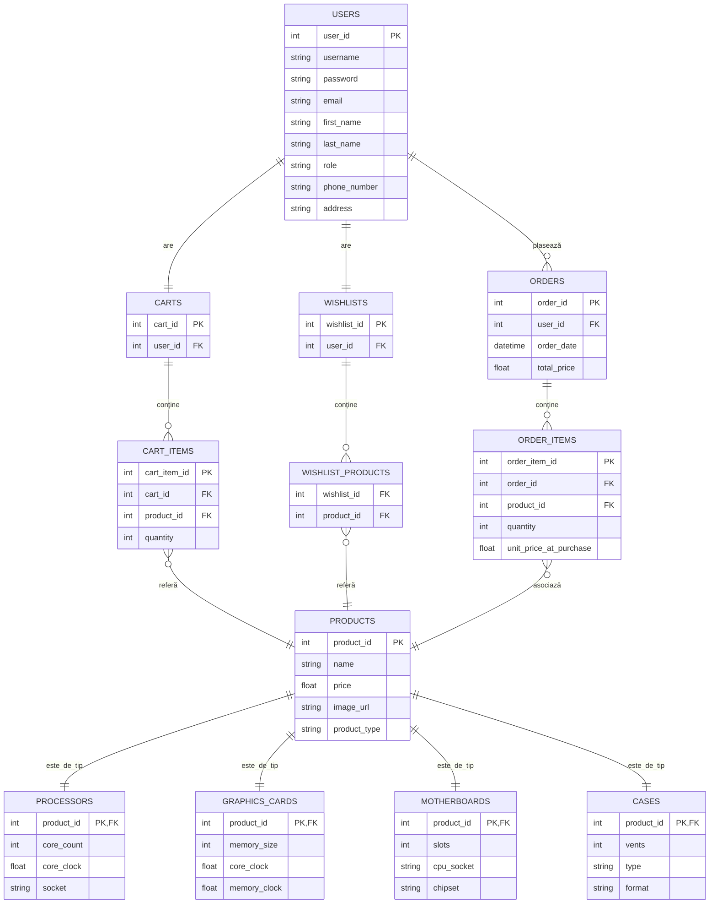
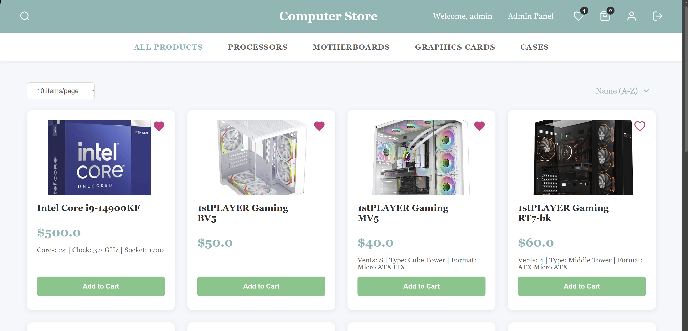
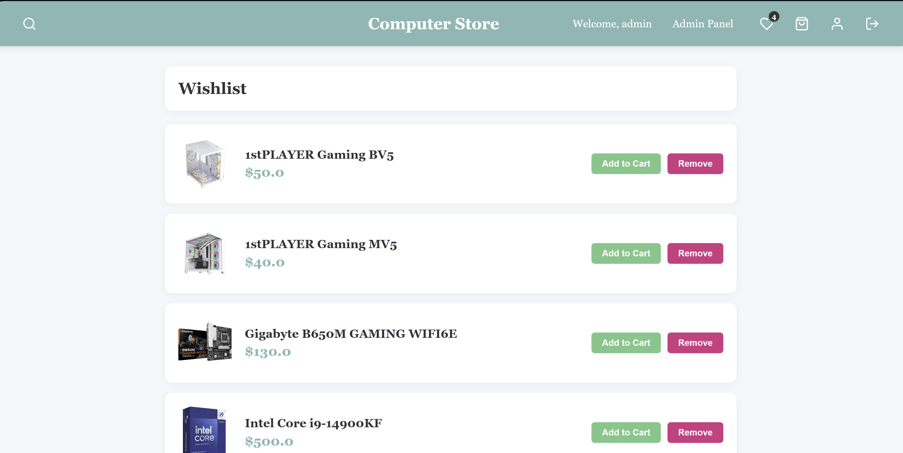
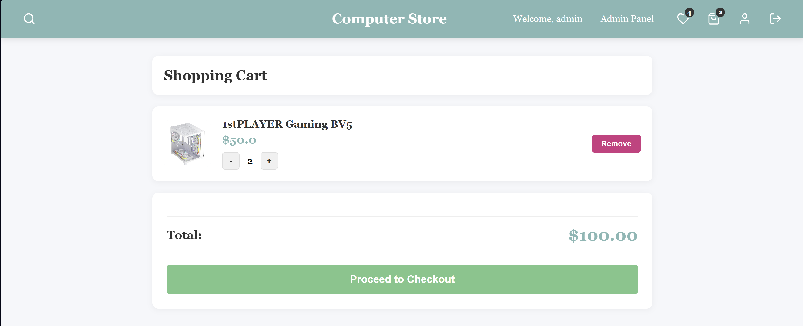
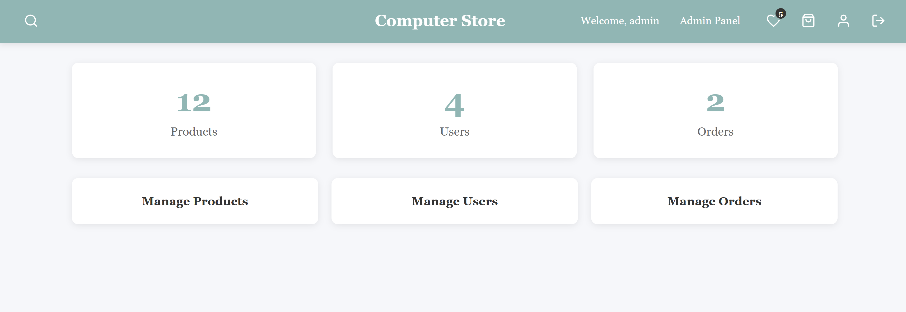
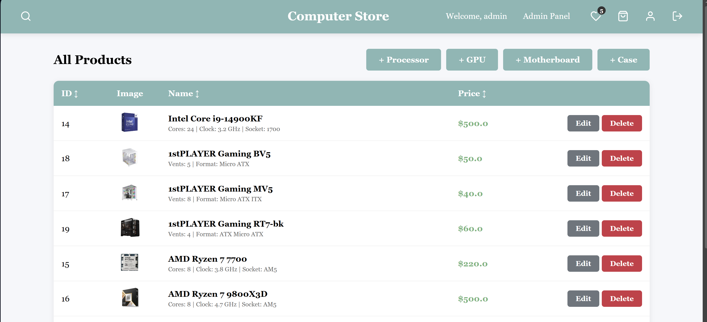

# Computer Store - Microservices Architecture

An e-commerce platform for computer hardware components built with Spring Boot, Spring Cloud, and Docker.

## Features

- **Microservices Architecture**: Fully decoupled services (Store, User, Gateway, Config, Discovery, and Notification)
- **Centralized Configuration**: Spring Cloud Config Server backed by a local Git repository (`config-repo`)
- **Service Discovery**: Netflix Eureka for dynamic service registration and discovery
- **API Gateway**: Spring Cloud Gateway for centralized routing, SSL/HTTPS, and rate-limiting
- **Resilience & Fault Tolerance**: Resilience4j Circuit Breaker, Retry, and Fallback mechanisms
- **Security**: Stateless JWT authentication distributed across microservices, Role-Based Access Control (RBAC)
- **Monitoring & Observability**: Full Prometheus & Grafana stack with custom dashboards, Zipkin distributed tracing
- **Database & Caching**: PostgreSQL for persistent data, H2 for testing, Redis for NoSQL caching (`@Cacheable`) and Rate Limiting
- **CI/CD**: GitHub Actions pipeline for automated building, testing (JaCoCo), and Dockerization
- **Shopping Cart & Wishlist**: Manage items in a persistent cart (DB-backed) and save favorites in a many-to-many wishlist.
- **Admin Panel**: Full CRUD for products, users and orders with pagination and sorting.

## Architecture & Tech Stack

The system is decomposed into 6 independent microservices:
1. `config-server` (Port 8888) - Centralized configuration management
2. `discovery-server` (Port 8761) - Eureka service registry
3. `api-gateway` (Port 8443) - Secure entry point, CORS, Rate Limiting
4. `user-service` (Port 8082, 8083) - Manages users, JWT authentication, BCrypt encryption (2 instances for Load Balancing)
5. `store-service` (Port 8081) - Manages products (CQRS Pattern), orders, cart, and wishlist
6. `notification-service` (Port 8084) - Decoupled notification dispatch simulation (OpenFeign)

- **Backend:** Java 21, Spring Boot 3.2.0, Spring Cloud, Spring Security
- **Frontend:** Thymeleaf HTML5, CSS3, JavaScript
- **Databases:** PostgreSQL 16 (Dev/Prod), H2 (Test), Redis 7
- **DevOps:** Docker, Docker Compose, GitHub Actions
- **Testing:** JUnit 5, Mockito, JaCoCo (Code Coverage >70%)
- **Logging:** SLF4J + Logback (AOP aspect-based logging)

## Database Schema (ER Diagram)


### Mermaid Diagram Alternative
*GitHub renders this interactive diagram natively:*



The project includes 11 entities with various relationship types:
- **Entities:** `User`, `Product`, `Order`, `OrderItem`, `Cart`, `CartItem`, `Wishlist`, `Processor`, `GraphicsCard`, `Motherboard`, `Case`.
- **Relationships:**
    - `@OneToOne`: User ↔ Cart, User ↔ Wishlist
    - `@OneToMany`/`@ManyToOne`: User ↔ Order, Order ↔ OrderItem, Cart ↔ CartItem
    - `@ManyToMany`: Wishlist ↔ Product
- **Inheritance:** `Product` is the base class for component-specific entities (JOINED strategy).

## How to Run Locally

### 1. Run with Docker Compose (Recommended)
This will start all databases, infrastructure, and the 6 microservices automatically.

First compile the Java code:
```bash
mvn clean package -DskipTests
```

Then start the services:
```bash
docker compose up -d --build
```
*Note: The `user-service` scales to 2 instances to demonstrate client-side load balancing.*

### 2. Run the Monitoring Stack
To launch Prometheus, Grafana, and Zipkin:
```bash
docker compose -f docker-compose-monitoring.yml up -d
```

### Access Points
- **Store Application (UI):** `https://localhost:8443/api/store/login` (Via Gateway)
- **Eureka Dashboard:** `http://localhost:8761`
- **Grafana Dashboard:** `http://localhost:3000` (User: `admin`, Password: `admin123`)
- **Zipkin Dashboard:** `http://localhost:9411`
- **Swagger UI:** `http://localhost:8081/swagger-ui.html`

## Documentation
For an in-depth view of the entities, relationship definitions, and business requirements: [MVP Requirements Document](MVP_Requirements_Document.md).

For a summary of how AI agents were used during development: [AI Usage Report](AI_usage_report.md).

## Screenshots







